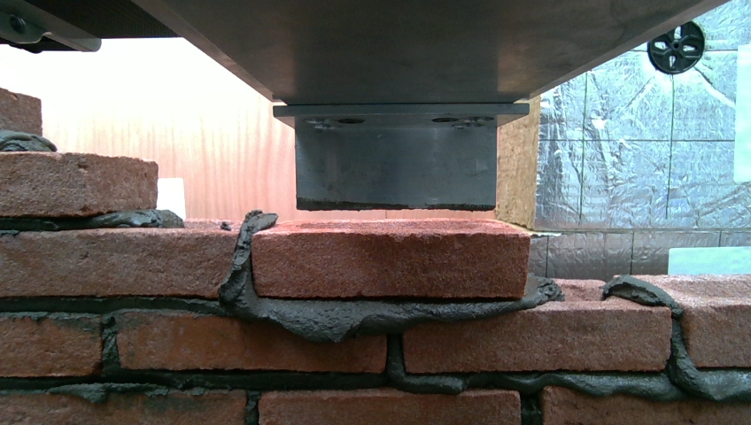

# Brick Pose Estimation

## Introduction

The assignment aims at estimating the pose of a brick placed by the robot using inputs from an RGBD camera.

There are a few assumptions made during the crafting of the solution:

- The RGB image and the the Depth image are temporally aligned which equates to the depth value at a position in the depth image accurately corresponds to the pixel at the same position on the rgb image
- The camera instrinsic parameters are the same for all images
- The rotation about the z-axis is minimal ( the method used to segment the brick face is a binned depth based filter)

## Steps

1. The brick closest to the image center is segmented using Meta’s Segment Anything Model(SAM). This model takes in an RGB image and outputs masks of all objects seen in the image. We choose the mask that is closest to the image center. (This can be improved by having a detector detect bounding boxes and prompting SAM with the bounding box closest to the center too, to eliminate the chance of the robot’s boom arm or some background markers to get selected) 
    
    
    
    
    
2. Now I use this mask to get the depth values of the brick and use histogram based binning to choose a range of depth to select the face of the brick. ( This is not ideal as large rotations can cause issues in this filtering. The best way is to estimate normals but I need better depth quality to be able to do that)
    
    
    
    
    
3. Now I find the contour of this filtered depth map and then simplify this contour to get a 4 point polygon
    
    
    
    
    
4. With the knowledge of the dimensions of the brick, we can use OpenCV’s **Perspective-n-Point** algorithm to estimate the orientation and translation of the brick with respect to the camera’s optical centre

## Conclusion

The method would work the best if the long face of the brick is correctly segmented but real world effects need to be considered. Given more time , I would consider using depth smoothing and normal estimation to make the method more robust. Given more resources, I would fine-tune and implement Pose Estimation Transformer (PoET) which has shown tremendous potential in estimating poses of regular objects.
